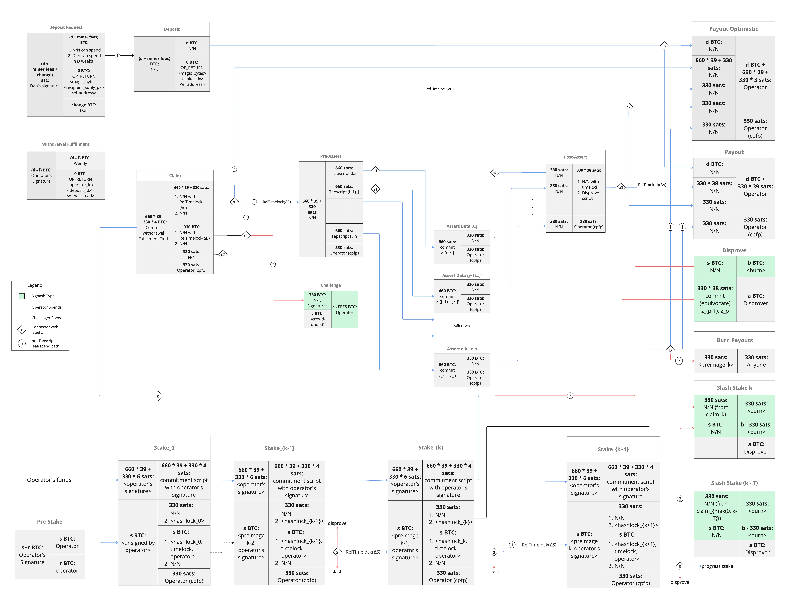
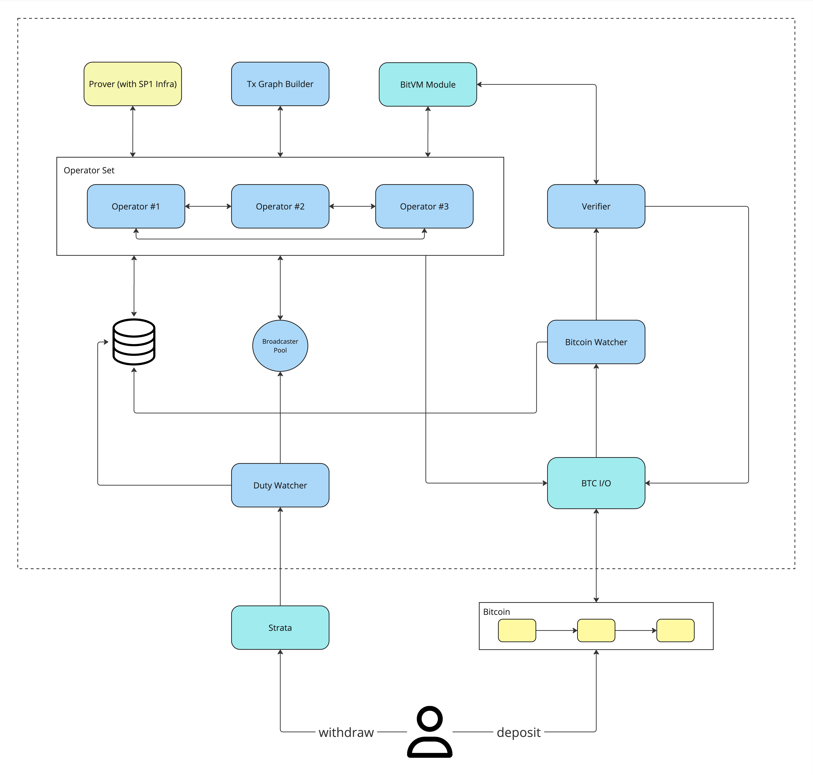

# Strata Bridge

A reference implementation of Strata Bridge by your friends at [Alpen Labs](https://www.alpenlabs.io/).

> [!IMPORTANT]
> This software is a work-in-progress and as such, is _not_ meant to be used in a production environment!

## Transaction Graph

The following is the transaction graph that has been implemented in this repository:

<figure>
    
    <figcaption>The transaction graph for this repository.</figcaption>
</figure>

## System Diagram

The following is the system diagram for this repository:

<figure>
    
    <figcaption>The system diagram for this repository.</figcaption>
</figure>

## How To Run Locally

### Prerequisites

-   [cargo](https://doc.rust-lang.org/cargo/getting-started/installation.html).
-   [SP1 Toolchain](https://docs.succinct.xyz/docs/sp1/getting-started/install) and associated [linkers](https://github.com/xpack-dev-tools/riscv-none-elf-gcc-xpack/releases/tag/v14.2.0-2).
-   Credentials to connect to SP1's [infra](https://explorer.succinct.xyz).
-   [Docker](https://docs.docker.com/get-docker/).
-   [`sqlx-cli`](https://lib.rs/crates/sqlx-cli) to run database migrations.
-   [`bitcoind`](https://bitcoin.org/en/download) to run the unit tests.
-   [`just`](https://just.systems/) to run the commands in this repository.

### Running

Run the Strata stack (`strata-client`, `strata-reth`, `bitcoind`) as per the instructions
in the [`alpen`](https://github.com/alpenlabs/alpen/tree/bitvm2) repository.

Then, see the instructions in [`docker/README.md`](./docker/README.md) to run the bridge nodes
and their corresponding secret-service nodes.

## Contributing

Contributions are generally welcome.
If you intend to make larger changes, please discuss them in an issue
before opening a PR to avoid duplicate work and architectural mismatches.

For more information please see [`CONTRIBUTING.md`](/CONTRIBUTING.md).

## License

This work is dual-licensed under MIT and Apache 2.0.
You can choose between one of them if you use this work.
